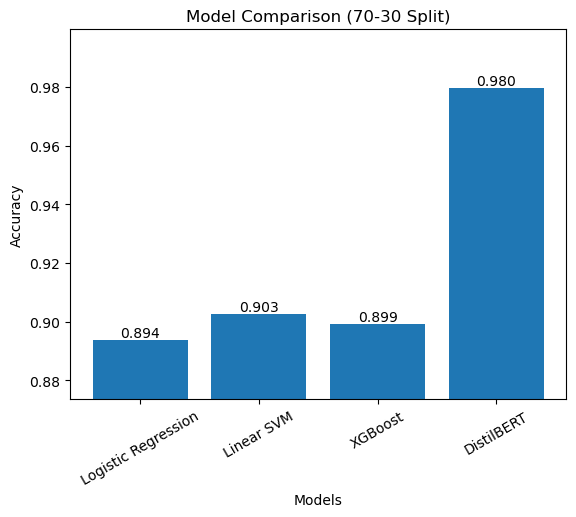
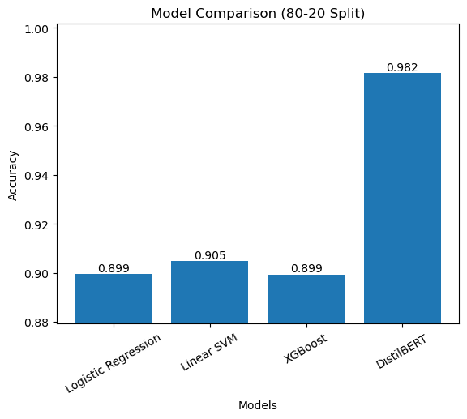
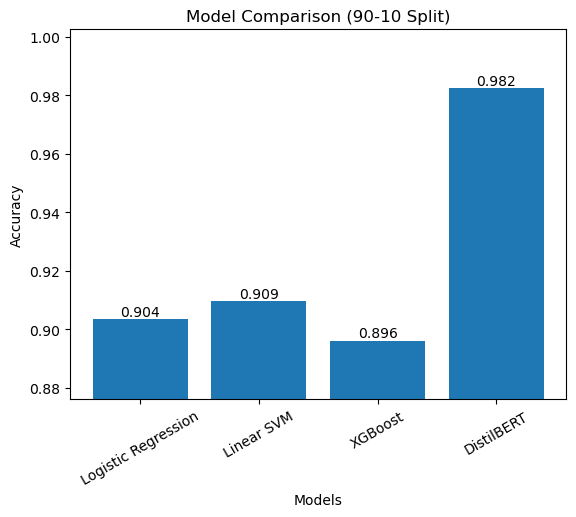

# Linguistic Fingerprinting for Deception Detection

A deception detection pipeline using linguistic fingerprinting, hybrid NLP features, classical machine learning, and DistilBERT.

## Tech Stack

- Python
- Pandas
- NumPy
- Scikit-learn
- NLTK
- XGBoost
- DistilBERT
- SHAP
- Matplotlib
- PyTorch
- Hugging Face Transformers
- 🤖 `datasets`

## Overview

This project analyzes more than 40,000 review texts to detect deceptive writing using a hybrid feature engineering strategy. It combines TF-IDF embeddings with stylometric and linguistic signals such as:

- lexical diversity
- sentence complexity
- punctuation frequency
- capitalization patterns
- readability and length metrics

## Model Workflow

1. Load and preprocess the labeled review dataset from `data.csv`
2. Extract TF-IDF features with unigrams and bigrams
3. Compute custom linguistic fingerprint features
4. Scale and concatenate classical and stylistic features
5. Train and benchmark:
   - Logistic Regression
   - Linear SVM
   - XGBoost
6. Evaluate models across multiple stratified train-test splits
7. Apply 5-fold cross-validation for stability
8. Run SHAP explainability for feature importance analysis
9. Train DistilBERT for end-to-end text classification

## Results

- Linear SVM achieved up to **90.95% accuracy**
- DistilBERT achieved **98.24% accuracy**, with **99.14% precision** and **98.26% F1-score**
- DistilBERT outperformed classical models by over **7 percentage points**

## Performance Plots

### 60-40 Split Accuracy


### 70-30 Split Accuracy



### 80-20 Split Accuracy



### 90-10 Split Accuracy



## Files

- `deception_detection.py` — primary modeling script
- `data.csv` — raw review dataset
- `requirements.txt` — Python dependencies
- `results_60_40.txt`, `results_70_30.txt`, `results_80_20.txt`, `results_90_10.txt` — split-specific model logs
- `plot_60_40.png`, `plot_70_30.png`, `plot_80_20.png`, `plot_90_10.png` — accuracy comparison visualizations

## Installation

```bash
cd Linguistic-Fingerprinting
python -m venv .venv
.venv\Scripts\activate
pip install -r requirements.txt
```

## Usage

```bash
python deception_detection.py
```

## Notes

- The script uses `nltk` tokenization and downloads the `punkt` resource on first run.
- DistilBERT training runs on GPU when available; otherwise it falls back to CPU.
- SHAP analysis is performed against the XGBoost model.

## License

This project demonstrates a freelance or academic proof-of-concept for linguistic deception detection and explainable NLP modeling.
