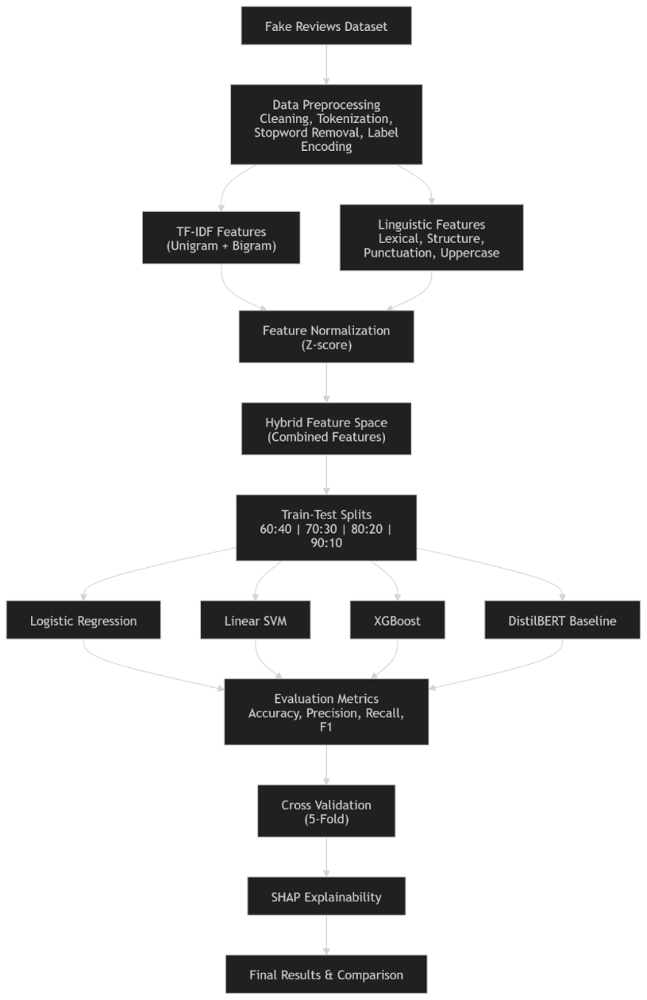

# Linguistic Fingerprinting for Deception Detection

A machine learning project for detecting deceptive online reviews using TF-IDF features, linguistic feature engineering, classical machine learning models, and a DistilBERT baseline.

**Key Results:** 98.24% Accuracy • 99.14% Precision • 98.23% F1 Score

## Overview

This project investigates whether linguistic characteristics of text can help distinguish between genuine and deceptive reviews.

The approach combines TF-IDF representations with engineered linguistic features such as lexical diversity, sentence count, punctuation usage, and capitalization patterns. Multiple machine learning models are evaluated and compared against a fine-tuned DistilBERT baseline.

The dataset contains **40,432 reviews**, evenly split between authentic and deceptive reviews.

---

## Project Workflow



The pipeline consists of:

1. Data preprocessing and cleaning
2. TF-IDF feature extraction (unigrams and bigrams)
3. Linguistic feature extraction
4. Feature normalization and concatenation
5. Model training and evaluation
6. Cross-validation
7. SHAP explainability analysis
8. Comparison with a DistilBERT baseline

---

## Tech Stack

### Data Processing
- Python
- Pandas
- NumPy
- NLTK

### Machine Learning
- Scikit-learn
- TF-IDF
- Logistic Regression
- Linear SVM
- XGBoost

### Deep Learning
- PyTorch
- DistilBERT

### Explainability & Visualization
- SHAP
- Matplotlib

---

## Dataset

**Fake Reviews Dataset (Kaggle)**

- Total Reviews: 40,432
- Authentic Reviews (OR): 20,216
- Deceptive Reviews (CG): 20,216

Dataset:
https://www.kaggle.com/datasets/mexwell/fake-reviews-dataset

---

## Feature Engineering

### TF-IDF Features

- Unigrams
- Bigrams
- Maximum 5000 features

### Linguistic Features

- Word count
- Sentence count
- Average word length
- Lexical diversity
- Punctuation count
- Uppercase character ratio

The linguistic features are normalized and combined with TF-IDF vectors to create a hybrid feature representation.

---

## Models Evaluated

### Classical Machine Learning

- Logistic Regression
- Linear SVM
- XGBoost

### Transformer Baseline

- DistilBERT (fine-tuned for binary classification)

---

## Results

| Model | Accuracy |
|---------|------------|
| Logistic Regression | 90.36% |
| Linear SVM | 90.95% |
| XGBoost | 89.61% |
| DistilBERT | 98.24% |

### DistilBERT Metrics (90:10 Split)

| Metric | Score |
|----------|--------|
| Accuracy | 98.24% |
| Precision | 99.14% |
| Recall | 97.33% |
| F1 Score | 98.23% |

DistilBERT achieved the highest overall performance, while Linear SVM emerged as the strongest classical machine learning baseline.

### Key Findings

- Linear SVM achieved the strongest performance among classical machine learning models, reaching 90.95% accuracy.
- DistilBERT achieved 98.24% accuracy and outperformed all classical baselines across every train-test split.
- Model performance improved gradually as the proportion of training data increased.
- Linguistic features such as lexical diversity, average word length, and review length contributed meaningfully to classification performance.

---

## Explainability

SHAP analysis was applied to the XGBoost model to identify influential features.

Important features included:

- Lexical diversity
- Average word length
- Review length
- TF-IDF n-gram features

---

## Installation

```bash
pip install -r requirements.txt
```

## Usage

```bash
python deception_detection.py
```
